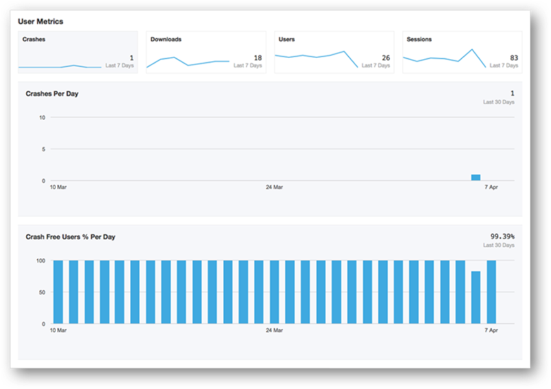
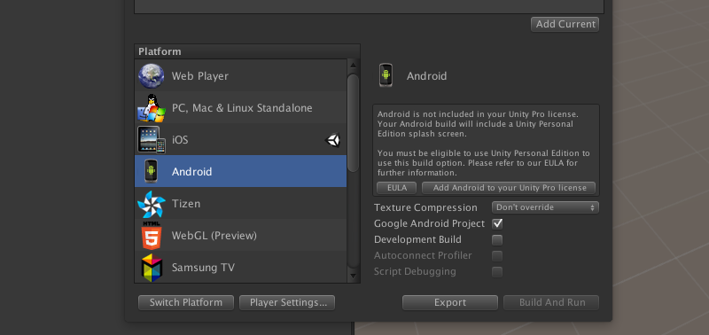

# Version 5.0.1

## Introduction

The HockeyAppUnity-Android plugin implements support for using HockeyApp in your Unity-Android builds. 

The following features are currently supported:

1. **Collect crash reports:** If your app crashes, a crash log is written to the device's storage. If the user starts the app again, they will be asked asked to submit the crash report to HockeyApp. This works for both beta and live apps, i.e. those submitted to Google Play or other app stores. Crash logs contain viable information for you to help resolve the issue.

2. **Collect exceptions** The HockeySDK-Unity-Android can automatically report uncaught managed exceptions coming from your C# code. Just like crashes, those exceptions will be sent on the next app start and are displayed on HockeyApp.

2. **User metrics:** Understand user behavior to improve your app. Track usage through daily and monthly active users. Monitor crash impacted users. Measure customer engagement through session count.

3. **Update alpha/beta apps:** The app will check with HockeyApp if a new version for your alpha/beta build is available. If yes, it will show a dialog to users and let them see the release notes, the version history and start the installation process right away. You can even force the installation of certain updates.

4. **Feedback:** Besides crash reports, collecting feedback from your users from within your app is a great option to help with improving your app. You act on and answer feedback directly from the HockeyApp backend.

5. **Authenticate:** To help you stay in control of closed tester groups, you can identify and authenticate users against your registered testers with the HockeyApp backend. The authentication feature supports several ways of authentication.

This document contains the following sections:

1. [Requirements](#1)
2. [Installation & Setup](#2)
3. [Examples](#3)
4. [Troubleshooting](#4)
5. [Code of Conduct](#5)
6. [Contributor License](#6)
7. [Licenses](#7)

## <a name="1"></a>Requirements

* [Changelog](Documentation/Changelog.md)
* Unity 5.0 or newer (SDK versions with Unity 4 support can be found at the [Unity Asset Store](https://www.assetstore.unity3d.com/en/?gclid=CO) or by switching to the 1.0.3 tag on GitHub).
* Android API level 15 or later.

## <a name="2"></a>Installation & Setup

The following steps illustrate how to integrate the HockeyAppUnity-Android plugin:

### 1) Import plugin
You can either import the plugin [from the Asset Store](https://www.assetstore.unity3d.com/en/#!/content/17759) or download the *.unitypackage* from our [GitHub releases page](https://github.com/bitstadium/HockeySDK-Unity-Android/releases) and install it by double-clicking the file. That's it!

**Note:** In case you've cloned the repo, simply copy the **HockeyAppUnityAndroid** folder into the **Assets** directory of your Unity project.


### 2) Modify AndroidManifest.xml
Change the value for **package** inside the AndroidManifest.xml (*Assets/HockeyAppUnityAndroid*) to the package identifier of your project.


### 3) Create plugin-GameObject
Create an empty game object (*GameObject -> Create Empty*) and add the **HockeyAppAndroid.cs** as one of its components.


Select the game object in the **Hierarchy** pane and fill in some additional informations inside the Inspector window. 

* **App ID** - the app ID provided by HockeyApp
* **Package ID** equals the package name of your HockeyApp app
* **Server URL** - if you have your own server instance, please type in its url. <span style="color: red">In most cases this field should be left blank.</span>
* **Authenticator Type** - an authentication type (see [Authenticating Users on Android](http://hockeyapp.net/help/sdk/android/4.0.0-beta.1/net/hockeyapp/android/LoginManager.html)). By default **BITAuthenticatorIdentificationTypeAnonymous** will be used.
* **Secret** - the secret provided by HockeyApp (only for authentication using email address)
* **Auto Upload Crashes** -  this option defines if the crash reporting feature should send crash reports automatically without asking the user on the next app start. 
* **Exception Logging** - by checking this option you will get more precise information about exceptions in your Unity scripts
* **Update Alert** - check this option if users should be informed about app updates from inside your app
* **User Metrics** - activating this feature will automatically usage data such as daily/monthly unique users and number of sessions per day


### 4) Configure build settings
You are now ready to build the project: Select **File -> Build Settings...** and switch to **Android** in the platform section. Check **Development Build** (see Build Settings section). 


That's it: Build your app / Android project as usual.

Your app will now send crash reports and user metrics (e.g. daily/monthly unique users, # of sessions per day) to the server without doing any additional work. To see those statistics just visit your app on the portal.



## <a name="build_settings"></a>Build Settings ##

The **Development Build** option affects the exception handling in C#. You will get a crash report in any case, but the data quality differs. It is recommend to enable it for alpha and beta builds, but to disable this option for production.

**Disabled Development Build**:
	
	IndexOutOfRangeException: Array index is out of range.
 		at (wrapper stelemref) object:stelemref (object,intptr,object)
 		at TestUI.OnGUI ()

**Enabled Development Build**:

	IndexOutOfRangeException: Array index is out of range.
 		at (wrapper stelemref) object:stelemref (object,intptr,object)
 		at TestUI.OnGUI () (at /Users/name/Documents/Workspace/HockeyAppUnity-Android/ExampleGame/Assets/TestUI/TestUI.cs:67)
 		
## <a name="3"></a>Examples

### Feedback Form

In order to provide your users with a feedback form, just call the following static method: 
	
	HockeyAppAndroid.ShowFeedbackForm(); 
	
### Explicitly check for updates

Usually, the update check happens everytime the app enters the foreground. If you'd like to explicitly trigger this check, please add the following to your code: 
	
	HockeyAppAndroid.CheckForUpdate(); 

## <a name="4"></a>Troubleshooting

If you have any problems with compiling or running the Unity Android project, please check the following points:

### Crash: Unable to find explicit activity class (UpdateActivity/FeedbackActivity)

If you get an exception with the following reason

	Unable to find explicit activity class {net.hockeyapp.ExampleGame/net.hockeyapp.android.UpdateActivity}
	
it is most likely caused by a corrupted manifest file merge. To fix that issue, please check the **Google Android Project** box inside the Android Build Settings and click the **Export** button.



Next, open the Android Studio project and define the missing activities inside the manifest file:
	
```xml
<application>
 	... 
	<activity android:name="net.hockeyapp.android.UpdateActivity" />
	<activity android:name="net.hockeyapp.android.FeedbackActivity" />
</application>
```

Build and run the project inside Android Studio.

## <a name="5"></a>Code of Conduct

This project has adopted the [Microsoft Open Source Code of Conduct](https://opensource.microsoft.com/codeofconduct/). For more information see the [Code of Conduct FAQ](https://opensource.microsoft.com/codeofconduct/faq/) or contact [opencode@microsoft.com](mailto:opencode@microsoft.com) with any additional questions or comments.

## <a name="6"></a>Contributor License

You must sign a [Contributor License Agreement](https://cla.microsoft.com/) before submitting your pull request. To complete the Contributor License Agreement (CLA), you will need to submit a request via the [form](https://cla.microsoft.com/) and then electronically sign the CLA when you receive the email containing the link to the document. You need to sign the CLA only once to cover submission to any Microsoft OSS project. 

## <a name="7"></a>Licenses

The Hockey SDK is provided under the following license:
	
	Copyright (c) Microsoft Corporation. All rights reserved.
	
	Permission is hereby granted, free of charge, to any person
	obtaining a copy of this software and associated documentation
	files (the "Software"), to deal in the Software without
	restriction, including without limitation the rights to use,
	copy, modify, merge, publish, distribute, sublicense, and/or sell
	copies of the Software, and to permit persons to whom the
	Software is furnished to do so, subject to the following
	conditions:
	
	The above copyright notice and this permission notice shall be
	included in all copies or substantial portions of the Software.
	
	THE SOFTWARE IS PROVIDED "AS IS", WITHOUT WARRANTY OF ANY KIND,
	EXPRESS OR IMPLIED, INCLUDING BUT NOT LIMITED TO THE WARRANTIES
	OF MERCHANTABILITY, FITNESS FOR A PARTICULAR PURPOSE AND
	NONINFRINGEMENT. IN NO EVENT SHALL THE AUTHORS OR COPYRIGHT
	HOLDERS BE LIABLE FOR ANY CLAIM, DAMAGES OR OTHER LIABILITY,
	WHETHER IN AN ACTION OF CONTRACT, TORT OR OTHERWISE, ARISING
	FROM, OUT OF OR IN CONNECTION WITH THE SOFTWARE OR THE USE OR
	OTHER DEALINGS IN THE SOFTWARE.

The following classes are based on code from the project 
android-remote-stacktrace:

+ Constants
+ CrashManager
+ ExceptionHandler

Source: http://code.google.com/p/android-remote-stacktrace/

The original license of these classes is:

	Copyright (c) 2009 nullwire aps
	
	Permission is hereby granted, free of charge, to any person
	obtaining a copy of this software and associated documentation
	files (the "Software"), to deal in the Software without
	restriction, including without limitation the rights to use,
	copy, modify, merge, publish, distribute, sublicense, and/or sell
	copies of the Software, and to permit persons to whom the
	Software is furnished to do so, subject to the following
	conditions:
	
	The above copyright notice and this permission notice shall be
	included in all copies or substantial portions of the Software.
	
	THE SOFTWARE IS PROVIDED "AS IS", WITHOUT WARRANTY OF ANY KIND,
	EXPRESS OR IMPLIED, INCLUDING BUT NOT LIMITED TO THE WARRANTIES
	OF MERCHANTABILITY, FITNESS FOR A PARTICULAR PURPOSE AND
	NONINFRINGEMENT. IN NO EVENT SHALL THE AUTHORS OR COPYRIGHT
	HOLDERS BE LIABLE FOR ANY CLAIM, DAMAGES OR OTHER LIABILITY,
	WHETHER IN AN ACTION OF CONTRACT, TORT OR OTHERWISE, ARISING
	FROM, OUT OF OR IN CONNECTION WITH THE SOFTWARE OR THE USE OR
	OTHER DEALINGS IN THE SOFTWARE.

Contributors:
+ Mads Kristiansen, mads.kristiansen@nullwire.com
+ Glen Humphrey
+ Evan Charlton
+ Peter Hewitt

The following class is based on code from the Android Open Source Project

Base64

	Copyright (C) 2010 The Android Open Source Project
	
	Licensed under the Apache License, Version 2.0 (the "License");
	you may not use this file except in compliance with the License.
	You may obtain a copy of the License at
	 
	http://www.apache.org/licenses/LICENSE-2.0
	  
	Unless required by applicable law or agreed to in writing, software
	distributed under the License is distributed on an "AS IS" BASIS,
	WITHOUT WARRANTIES OR CONDITIONS OF ANY KIND, either express or implied.
	See the License for the specific language governing permissions and
	limitations under the License.
